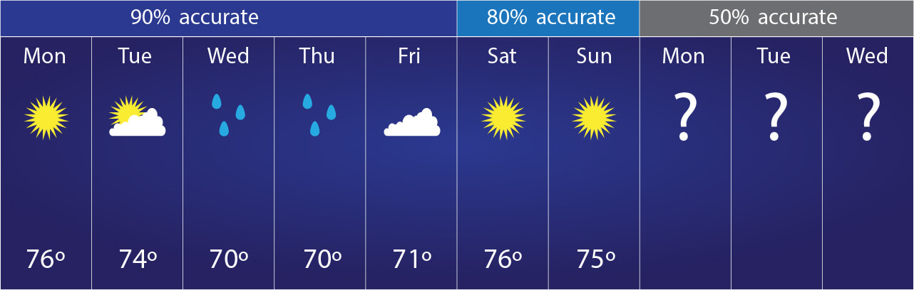

### [Predicting Maximum Temperature using Linear Regression](./PMT_LinReg)

In this exercise, we will explore the basic use of Pandas and will cover the basic commands of Exploratory Data Analysis (EDA) which includes cleaning, munging, combining, reshaping, slicing, dicing, and transforming data for analysis purpose. We will also develop a regression model to predict the Maximum Temperature.

Based on the weather data in the Summary of Weather dataset, develop a predictive model to determine the Maximum Temperature on a given day.

The dataset contains information on weather conditions recorded on each day at various weather stations around the world. Information includes precipitation, snowfall, temperatures, wind speed and whether the day included thunder storms or other poor weather conditions.
___
